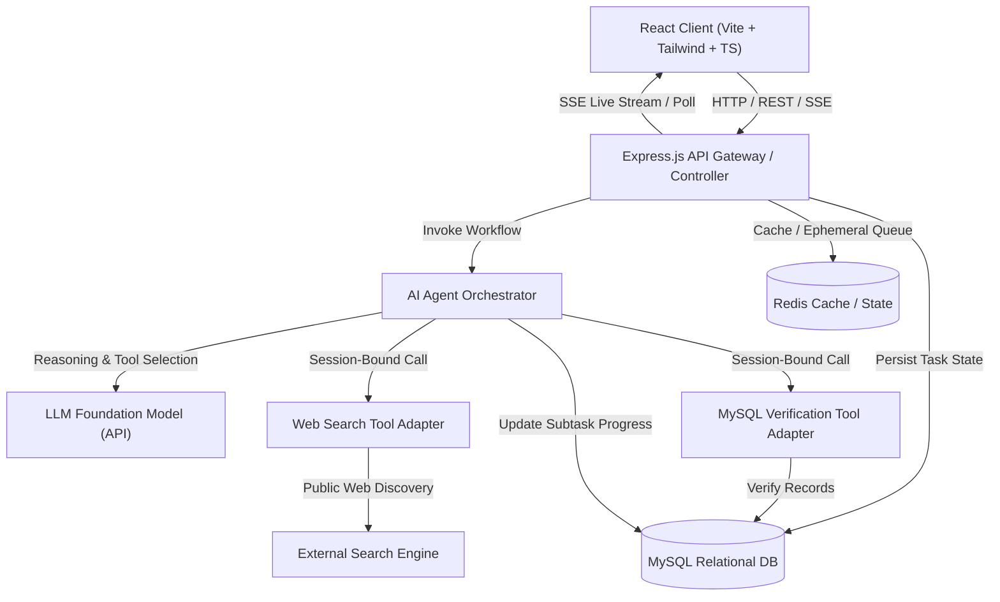
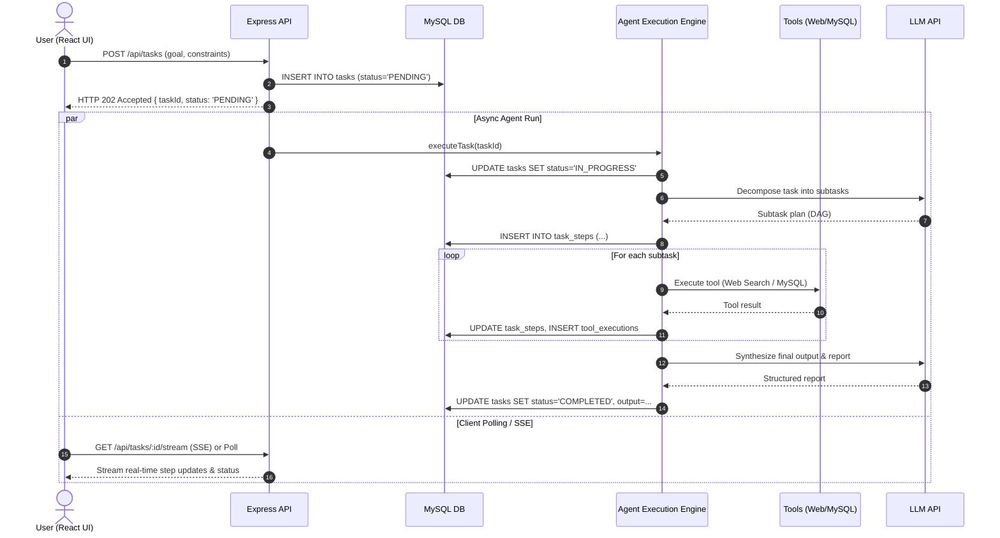
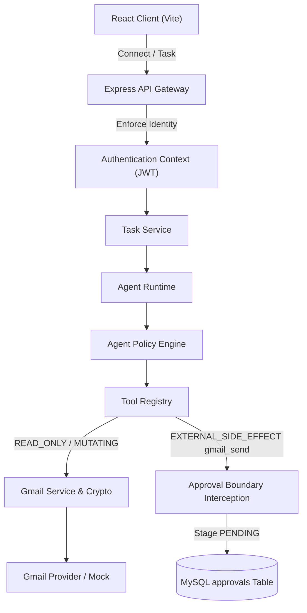
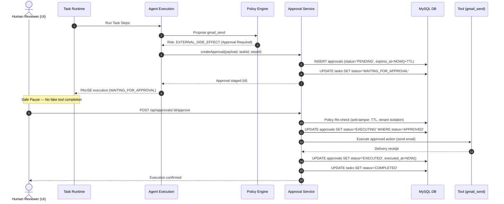

# System Architecture Specification

## 1. Architectural Overview

The **AI Workforce Platform** is an intelligent orchestration platform that accepts natural-language objectives and executes them through autonomous subtask decomposition, governed tool execution, and human-in-the-loop validation.



---

## 2. In-Process Asynchronous Execution Model (MVP)

To prevent HTTP request timeouts (which occur when multi-step LLM operations take 30–60+ seconds), the platform implements an **asynchronous task ingestion and streaming model**:



---

## 3. Session-Bound Execution Wrapper (Security & Multi-Tenancy)

To prevent prompt injection attacks or hallucinations from accessing unauthorized data:

1. **Host-Enforced Context:** The AI agent never receives raw database credentials or tenant IDs to pass as tool parameters.
2. **Context Injection:** When the agent calls a tool (e.g., `mysql_verify_customer`), the application host intercepts the call and injects the authenticated `userId` and `organizationId` from the verified session.
3. **Untrusted Data Tainting:** All raw scraped text from external web pages is encapsulated inside `<external_untrusted_data>` XML delimiters before entering the LLM prompt to prevent prompt injection hijacking.

---

## 4. Execution Watchdog & Fault Tolerance

The agent runtime is constrained by deterministic host governors:

| Parameter | MVP Value | Purpose |
| :--- | :--- | :--- |
| **Max Agent Cycles** | 10 iterations | Prevents infinite reasoning loops. |
| **Max Tool Calls per Step** | 3 invocations | Avoids recursive tool thrashing. |
| **Task Wall-Clock Timeout** | 180 seconds | Drops hung network connections. |
| **Tool HTTP Timeout** | 15 seconds | Prevents slow external APIs from stalling execution. |
| **Retry Backoff** | 2 retries (exponential) | Handles transient network hiccups. |

---

## 5. Phase 13 Authentication & Identity Propagation Architecture

Phase 13 establishes real server-validated identity and replaces placeholder/assumed identity with cryptographic JWT verification.

```text
┌───────────────────┐
│     Browser       │
│  Login / Bearer   │
└─────────┬─────────┘
          │ Authorization: Bearer <jwt>
          ▼
┌───────────────────┐
│ Express Middleware│
│    requireAuth    │
└─────────┬─────────┘
          │ Decodes JWT, validates signature/expiration,
          │ queries fresh user, attaches req.user
          ▼
┌───────────────────────────────────────────────┐
│ Trusted Request Context                       │
│  - req.userId (Internal stable identifier)   │
│  - req.organizationId (Tenant boundary)       │
│  - req.user.role (USER | ADMIN)               │
└─────────┬─────────────────────────────────────┘
          │ Host-controlled injection
          ├────────────────────────┬────────────────────────┐
          ▼                        ▼                        ▼
┌───────────────────┐    ┌───────────────────┐    ┌───────────────────┐
│    Agent Host     │    │   MySQL Queries   │    │  Qdrant / RAG     │
│ Context injection │    │ org_id filter     │    │ org_id filter     │
└─────────┬─────────┘    └───────────────────┘    └───────────────────┘
          ▼
┌───────────────────┐
│  Tool Executions  │
│  & Audit Logs     │
└───────────────────┘
```

### Core Architectural Invariants
1. **Server Controls Identity:** Client-supplied `userId` or `organizationId` in request bodies or query parameters are strictly ignored.
2. **Anti-IDOR:** Possessing a task or customer ID does not grant access. All resource retrievals enforce `organization_id = req.user.organizationId`.
3. **Cache Isolation:** Redis cache keys include the tenant namespace (`customers:<organizationId>:...`) to eliminate cross-tenant cache contamination.
4. **Audit Trail:** All authentication events (`USER_REGISTERED`, `USER_LOGIN_SUCCESS`, `USER_LOGIN_FAILED`) are permanently recorded in `audit_logs` with actor `user_id` and `organization_id`.

---

## 6. Phase 14 Task Management Architecture

Phase 14 establishes **work itself as a first-class citizen**, elevating execution from ad-hoc interactions into governed, durable business units.

```text
Authenticated User
        ↓ (req.user & req.organizationId)
Create Task (POST /api/tasks)
        ↓
Persist Task (MySQL: status = 'REQUESTED')
        ↓
Execute Task (POST /api/tasks/:id/run)
        ↓
State Transition: REQUESTED → RUNNING (409 Guard against duplicate runs)
        ↓
Agent Host Execution
        ├── Sequential Steps (MySQL: task_steps with deterministic step_order)
        ├── Governed Tools (MySQL: tool_executions linked via step_id)
        └── Telemetry & Cost (MySQL: ai_telemetry)
        ↓
Task Result Synthesis & Multi-Source Attribution
        ↓
Final Transition: RUNNING → COMPLETED / FAILED
        ↓
Durable History & Audit Trail (MySQL: audit_logs)
```

### Deterministic State Machine

```text
                 ┌──────────────┐
                 │  REQUESTED   │
                 └──────┬───────┘
                        │
                        ▼
                 ┌──────────────┐
                 │   RUNNING    │
                 └───┬──────┬───┘
                     │      │
              success│      │failure
                     │      │
                     ▼      ▼
              ┌──────────┐ ┌────────┐
              │COMPLETED │ │ FAILED │
              └──────────┘ └────────┘
                     ▲
                     │
                     │ cancellation
                     │
                 ┌───┴────────┐
                 │ CANCELLED  │
                 └────────────┘
```

- **LLM Boundary:** The LLM proposes tool invocations or answers; the application host strictly owns state transitions and lifecycle status.
- **Anti-IDOR:** Attempting to retrieve or modify another tenant's task yields HTTP 404 (preventing resource existence disclosure).
- **Concurrency Protection:** Starting an already running task or transitioning from terminal states (`COMPLETED`, `FAILED`, `CANCELLED`) yields HTTP 409 Conflict.
- **Cancellation:** Permitted only from active states (`REQUESTED` or `RUNNING`). Terminal tasks cannot be cancelled.

---

## 7. Phase 15 Advanced Agent Architecture

Phase 15 elevates the execution system into an authoritative, deterministic, resumable, multi-step **Advanced Agent Runtime**.

### Core Architectural Principle
> **"The LLM proposes. The Agent Host decides. The application executes."**

The LLM is strictly treated as an untrusted advisory component. It never owns:
- Task or step lifecycle status
- Tenant identity or user authentication
- Tool authorization or permission scoping
- Retry limits or watchdog policies
- Database or vector database operations

```text
                    ┌─────────────────────┐
                    │     React Client    │
                    └──────────┬──────────┘
                               │
                               ▼
                    ┌─────────────────────┐
                    │    Express API      │
                    └──────────┬──────────┘
                               │
                               ▼
                    ┌─────────────────────┐
                    │ Authentication      │
                    │ + Tenant Context    │
                    └──────────┬──────────┘
                               │
                               ▼
                    ┌─────────────────────┐
                    │    Task Service     │
                    └──────────┬──────────┘
                               │
                               ▼
                    ┌─────────────────────┐
                    │   Agent Runtime     │
                    │                     │
                    │ Planner             │
                    │ Policy Gateway      │
                    │ Context Manager     │
                    │ Step Scheduler (DAG)│
                    │ Decision Validator  │
                    │ Watchdogs           │
                    │ Synthesis Engine    │
                    └──────────┬──────────┘
                               │
                ┌──────────────┼──────────────┐
                │              │              │
                ▼              ▼              ▼
             LLM          Tool Registry    Task State (MySQL)
                              │
              ┌───────────────┼────────────────┐
              │               │                │
              ▼               ▼                ▼
          Web Search       MySQL/RAG       Local Tools
```

### Key Subsystems & Boundaries

1. **Structured DAG Planning & Cycle Detection (`agentDAG.ts`):**
   - Plans are modeled as Directed Acyclic Graphs with explicit step prerequisites (`dependencies[]`).
   - Evaluated by a 3-color DFS traversal (`WHITE`, `GRAY`, `BLACK`) detecting circular dependencies, self-dependencies, duplicate IDs, and dangling references before execution begins.
   - Deterministic `findNextRunnableStep` selects the lowest-order runnable step whose dependencies have all reached `COMPLETED`.

2. **Policy Gateway (`agentPolicy.ts`):**
   - Strictly enforces tool allowlists per step (`allowedTools[]`).
   - Categorizes risk levels (`READ_ONLY`, `LOW_RISK` vs blocked `MUTATING` / `EXTERNAL_SIDE_EFFECT`).
   - Rejects prohibited tools (`execute_sql`, `shell_exec`, `gmail_send`) even if requested by the LLM.
   - Injects server-verified tenant identity into all governed tool executions.

3. **Bounded Context Manager (`agentContext.ts`):**
   - Strictly bounds token/character budgets (`MAX_CONTEXT_CHARS`, `MAX_OBSERVATIONS`, `MAX_TOOL_OUTPUT_CHARS`).
   - Protects against indirect prompt injection by wrapping tool observations in explicit isolation tags:
     `<<<UNTRUSTED_EXTERNAL_OBSERVATION>>>`
   - Strips dangerous instruction patterns from untrusted observation payloads.

4. **Structured Decision Contract (`agentDecision.ts`):**
   - Requires strongly typed schema output: `CALL_TOOL`, `CONTINUE`, `COMPLETE`, `FAIL`.
   - Rejects unparseable or out-of-spec actions, falling back to safe parsing or failing cleanly.

5. **Execution Watchdogs (`agentWatchdog.ts`):**
   - Active governors:
     - `MAX_AGENT_CYCLES`: 15 iterations.
     - `MAX_TOOL_CALLS`: 20 total invocations.
     - `MAX_EXECUTION_TIME_MS`: 180,000 ms.
     - `MAX_STEP_RETRIES`: 2 attempts for transient errors.
     - `MAX_REPLANS`: 2 bounded replanning iterations.
     - `INFINITE_LOOP_PROTECTION`: SHA-256 fingerprint tracking halts consecutive identical tool calls.

6. **Bounded Recovery & Replanning (`agentPlanner.ts`):**
   - Categorizes failures into `VALIDATION_ERROR`, `POLICY_ERROR`, `PROVIDER_ERROR`, `TIMEOUT_ERROR`, `UNKNOWN_ERROR`.
   - On recoverable step failure, generates updated remaining steps with sanitized dependencies tied to existing completed steps.

7. **Multi-Source Grounded Synthesis (`agentResult.ts`):**
   - Gathers execution observations across `Customer Database (MySQL)`, `Web Search`, and `Internal Knowledge Base (Qdrant)`.
   - Produces a grounded report with verified findings and confidence scores.

---

## 11. Gmail Automation & External Communication (Phase 16)

Phase 16 introduces **Gmail as the first major external communication capability**, establishing distinct risk tiers between data retrieval and external side effects:



### Key Design Principles & Security Controls:
1. **Risk Tiering:**
   - `READ_ONLY`: `gmail_get_profile`, `gmail_search`, `gmail_get_message`.
   - `MUTATING`: `gmail_create_draft` (mailbox mutation only, clearly marked `DRAFT CREATED — NOT SENT`).
   - `EXTERNAL_SIDE_EFFECT`: `gmail_send` (strictly intercepted at approval boundary, staged in MySQL `approvals`).
2. **Credential Security at Rest:**
   - Access and refresh tokens encrypted with AES-256-GCM (`iv:authTag:ciphertext`).
   - Zero plaintext tokens exposed in responses, logs, prompts, or UI.
3. **OAuth 2.0 Anti-CSRF:**
   - HMAC-SHA256 signed `state` tokens bound to `userId`, `organizationId`, and timestamp with automatic expiry (>15 min) and tamper rejection.
4. **Prompt Injection Containment:**
   - Cheerio-based HTML sanitization stripping scripts, styles, and trackers.
   - Untrusted email bodies wrapped in `<<<UNTRUSTED_EXTERNAL_EMAIL>>>` inert delimiters with safety notices and size bounds (`MAX_EMAIL_BODY_CHARS: 4000`).
5. **Multi-Tenant Scoping:**
   - All Gmail connections are scoped strictly to authenticated `user_id` and `organization_id`.

---

## 12. Human Approval & Controlled External Actions (Phase 17)

Phase 17 introduces the formal **Human-in-the-Loop (HITL) Governance & Approval System** for sensitive AI workforce actions.



### Core Governance Axioms:
1. **Durable State Transitions:** Approval is an authenticated, tenant-isolated state transition in MySQL, never an LLM token or client boolean.
2. **Immutable Action Binding:** The stored execution payload is strictly verified against the approved proposal before dispatch.
3. **Double-Execution Guard:** Atomic transition (`APPROVED` -> `EXECUTING`) prevents duplicate execution during network retries or concurrent clicks.
4. **Anti-IDOR & Multi-Tenancy:** Scoped by authenticated `organizationId`; cross-tenant review is rejected with 404/403.
5. **No Blind Approval:** Human review UI displays complete proposed action details (tool, recipient, subject, sanitized body preview, risk badge, TTL countdown) and captures reviewer notes.
