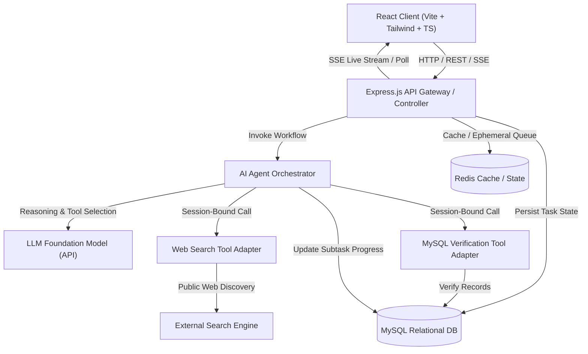
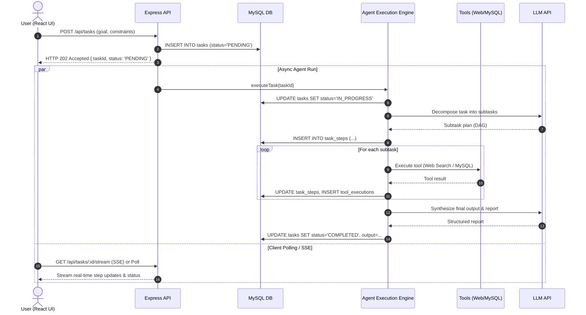

# System Architecture Specification

## 1. Architectural Overview

The **AI Workforce Platform** is an intelligent orchestration platform that accepts natural-language objectives and executes them through autonomous subtask decomposition, governed tool execution, and human-in-the-loop validation.



---

## 2. In-Process Asynchronous Execution Model (MVP)

To prevent HTTP request timeouts (which occur when multi-step LLM operations take 30–60+ seconds), the platform implements an **asynchronous task ingestion and streaming model**:



---

## 3. Session-Bound Execution Wrapper (Security & Multi-Tenancy)

To prevent prompt injection attacks or hallucinations from accessing unauthorized data:

1. **Host-Enforced Context:** The AI agent never receives raw database credentials or tenant IDs to pass as tool parameters.
2. **Context Injection:** When the agent calls a tool (e.g., `mysql_verify_customer`), the application host intercepts the call and injects the authenticated `userId` and `organizationId` from the verified session.
3. **Untrusted Data Tainting:** All raw scraped text from external web pages is encapsulated inside `<external_untrusted_data>` XML delimiters before entering the LLM prompt to prevent prompt injection hijacking.

---

## 4. Execution Watchdog & Fault Tolerance

The agent runtime is constrained by deterministic host governors:

| Parameter | MVP Value | Purpose |
| :--- | :--- | :--- |
| **Max Agent Cycles** | 10 iterations | Prevents infinite reasoning loops. |
| **Max Tool Calls per Step** | 3 invocations | Avoids recursive tool thrashing. |
| **Task Wall-Clock Timeout** | 180 seconds | Drops hung network connections. |
| **Tool HTTP Timeout** | 15 seconds | Prevents slow external APIs from stalling execution. |
| **Retry Backoff** | 2 retries (exponential) | Handles transient network hiccups. |

---

## 5. Phase 13 Authentication & Identity Propagation Architecture

Phase 13 establishes real server-validated identity and replaces placeholder/assumed identity with cryptographic JWT verification.

```text
┌───────────────────┐
│     Browser       │
│  Login / Bearer   │
└─────────┬─────────┘
          │ Authorization: Bearer <jwt>
          ▼
┌───────────────────┐
│ Express Middleware│
│    requireAuth    │
└─────────┬─────────┘
          │ Decodes JWT, validates signature/expiration,
          │ queries fresh user, attaches req.user
          ▼
┌───────────────────────────────────────────────┐
│ Trusted Request Context                       │
│  - req.userId (Internal stable identifier)   │
│  - req.organizationId (Tenant boundary)       │
│  - req.user.role (USER | ADMIN)               │
└─────────┬─────────────────────────────────────┘
          │ Host-controlled injection
          ├────────────────────────┬────────────────────────┐
          ▼                        ▼                        ▼
┌───────────────────┐    ┌───────────────────┐    ┌───────────────────┐
│    Agent Host     │    │   MySQL Queries   │    │  Qdrant / RAG     │
│ Context injection │    │ org_id filter     │    │ org_id filter     │
└─────────┬─────────┘    └───────────────────┘    └───────────────────┘
          ▼
┌───────────────────┐
│  Tool Executions  │
│  & Audit Logs     │
└───────────────────┘
```

### Core Architectural Invariants
1. **Server Controls Identity:** Client-supplied `userId` or `organizationId` in request bodies or query parameters are strictly ignored.
2. **Anti-IDOR:** Possessing a task or customer ID does not grant access. All resource retrievals enforce `organization_id = req.user.organizationId`.
3. **Cache Isolation:** Redis cache keys include the tenant namespace (`customers:<organizationId>:...`) to eliminate cross-tenant cache contamination.
4. **Audit Trail:** All authentication events (`USER_REGISTERED`, `USER_LOGIN_SUCCESS`, `USER_LOGIN_FAILED`) are permanently recorded in `audit_logs` with actor `user_id` and `organization_id`.

---

## 6. Phase 14 Task Management Architecture

Phase 14 establishes **work itself as a first-class citizen**, elevating execution from ad-hoc interactions into governed, durable business units.

```text
Authenticated User
        ↓ (req.user & req.organizationId)
Create Task (POST /api/tasks)
        ↓
Persist Task (MySQL: status = 'REQUESTED')
        ↓
Execute Task (POST /api/tasks/:id/run)
        ↓
State Transition: REQUESTED → RUNNING (409 Guard against duplicate runs)
        ↓
Agent Host Execution
        ├── Sequential Steps (MySQL: task_steps with deterministic step_order)
        ├── Governed Tools (MySQL: tool_executions linked via step_id)
        └── Telemetry & Cost (MySQL: ai_telemetry)
        ↓
Task Result Synthesis & Multi-Source Attribution
        ↓
Final Transition: RUNNING → COMPLETED / FAILED
        ↓
Durable History & Audit Trail (MySQL: audit_logs)
```

### Deterministic State Machine

```text
                 ┌──────────────┐
                 │  REQUESTED   │
                 └──────┬───────┘
                        │
                        ▼
                 ┌──────────────┐
                 │   RUNNING    │
                 └───┬──────┬───┘
                     │      │
              success│      │failure
                     │      │
                     ▼      ▼
              ┌──────────┐ ┌────────┐
              │COMPLETED │ │ FAILED │
              └──────────┘ └────────┘
                     ▲
                     │
                     │ cancellation
                     │
                 ┌───┴────────┐
                 │ CANCELLED  │
                 └────────────┘
```

- **LLM Boundary:** The LLM proposes tool invocations or answers; the application host strictly owns state transitions and lifecycle status.
- **Anti-IDOR:** Attempting to retrieve or modify another tenant's task yields HTTP 404 (preventing resource existence disclosure).
- **Concurrency Protection:** Starting an already running task or transitioning from terminal states (`COMPLETED`, `FAILED`, `CANCELLED`) yields HTTP 409 Conflict.
- **Cancellation:** Permitted only from active states (`REQUESTED` or `RUNNING`). Terminal tasks cannot be cancelled.

