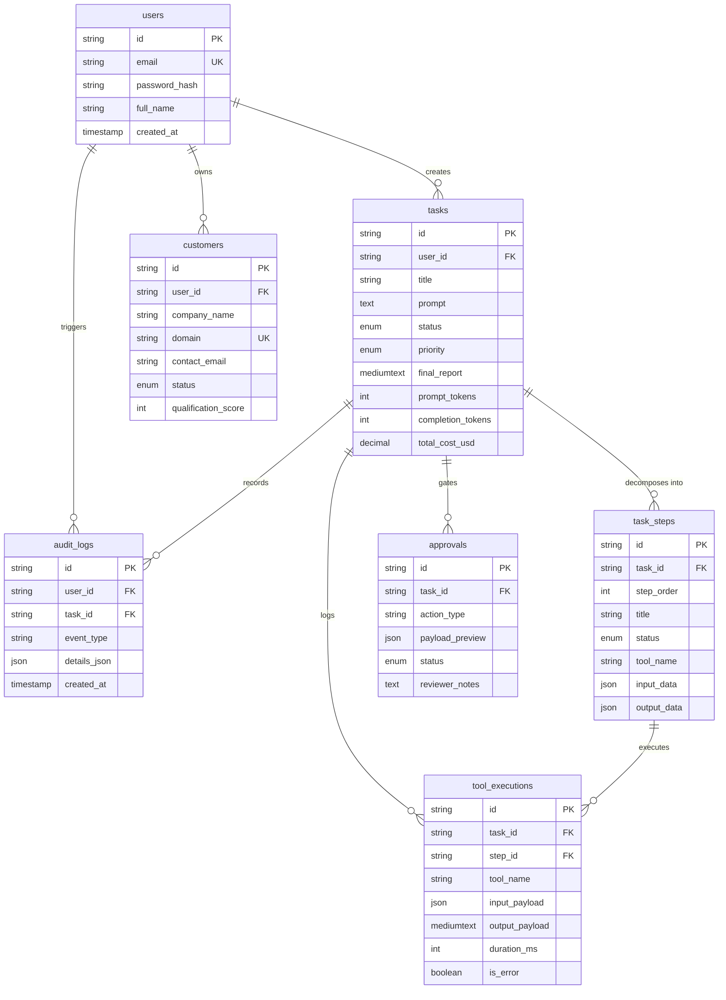

# Database Schema Specification

This document details the relational data model for the **AI Workforce Platform** implemented in MySQL 8.0+.

Reference DDL: [`docs/schema.sql`](file:///e:/ai-workforce-platform/docs/schema.sql)

---

## 1. Entity-Relationship Overview

---

## 2. Table Specifications

### 2.1 `users`
Represents platform accounts, authentication credentials, and multi-tenant scoping anchors.

### 2.2 `tasks`
The central operational entity representing a high-level user goal. Includes token usage metrics (`prompt_tokens`, `completion_tokens`, `total_cost_usd`) for financial observability.

### 2.3 `task_steps`
Represents individual subtasks generated by the AI agent during decomposition. Maintains execution sequencing (`step_order`) and status tracking.

### 2.4 `customers`
The operational CRM dataset. Stores discovered prospects and verifies against duplicates via composite uniqueness on `(user_id, domain)`.

### 2.5 `tool_executions`
Granular telemetry log recording every single internal/external tool invocation, arguments, response payloads, duration, and error codes.

### 2.6 `approvals`
Stateful Human-in-the-Loop staging table. Holds proposed mutations (e.g., email drafts, database updates) until explicitly reviewed by the user.

### 2.7 `audit_logs`
Immutable compliance and security record tracking sensitive events, logins, and approval decisions.
