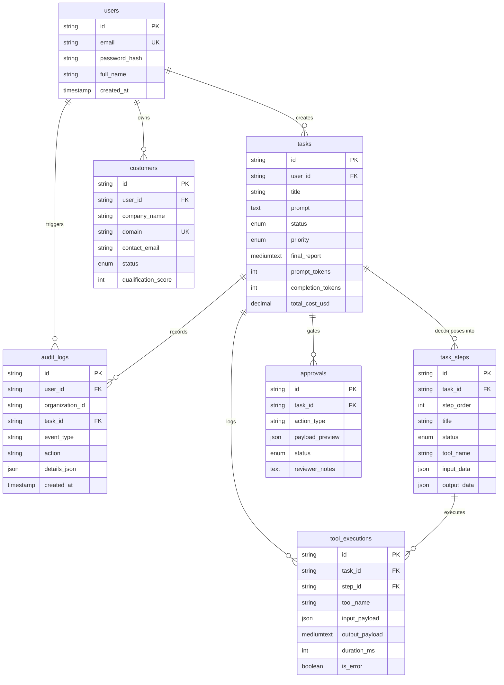

# Database Schema Specification

This document details the relational data model for the **AI Workforce Platform** implemented in MySQL 8.0+.

Reference DDL: [`docs/schema.sql`](file:///e:/ai-workforce-platform/docs/schema.sql)

---

## 1. Entity-Relationship Overview

---

## 2. Table Specifications

### 2.1 `users`
Represents platform accounts, authentication credentials, and multi-tenant scoping anchors.
- `id` (VARCHAR 64 PK): Internal stable user ID.
- `email` (VARCHAR 255 UNIQUE): Normalized lowercased email identity.
- `password_hash` (VARCHAR 255): bcrypt hashed password (never exposed to client).
- `full_name` (VARCHAR 100): Display name.
- `organization_id` (VARCHAR 64): Authoritative tenant ID.
- `role` (ENUM 'USER', 'ADMIN'): Access control role.

### 2.2 `tasks`
The central operational entity representing a durable unit of AI work.
- `id` (VARCHAR 36 PK): Stable unique task identifier.
- `user_id` (VARCHAR 64 FK): Creator identity derived from JWT.
- `organization_id` (VARCHAR 64): Authoritative tenant ID for strict query scoping.
- `title` (VARCHAR 255): Human-readable task title.
- `prompt` / `goal` (TEXT): Original user natural-language goal.
- `status` (ENUM 'PENDING', 'REQUESTED', 'QUEUED', 'IN_PROGRESS', 'RUNNING', 'AWAITING_APPROVAL', 'WAITING_FOR_APPROVAL', 'COMPLETED', 'FAILED', 'CANCELLED'): Authoritative host-controlled state machine (extended in Phase 18 with `QUEUED`).
- `priority` (ENUM 'LOW', 'NORMAL', 'HIGH', 'URGENT'): Execution priority.
- `final_report` (MEDIUMTEXT): Durable validated outcome/synthesis.
- `prompt_tokens`, `completion_tokens`, `total_cost_usd`: Telemetry metrics.
- `started_at`, `completed_at`, `created_at`, `updated_at`: Timestamps.

### 2.3 `task_steps`
Represents individual subtasks and execution milestones. Maintains deterministic execution sequence (`step_order`), tool references, inputs/outputs, and step status (`PENDING`, `IN_PROGRESS`, `WAITING_FOR_APPROVAL`, `COMPLETED`, `FAILED`, `SKIPPED`).
- In Phase 15, `input_data` stores DAG execution metadata: `{ "dependencies": string[], "allowedTools": string[], "description": string }` to power the deterministic step scheduler and UI dependency visualization.

### 2.4 `customers`
The operational CRM dataset. Scoped strictly to `organization_id` with composite uniqueness on `(user_id, domain)` to prevent cross-tenant leakage.

### 2.5 `tool_executions`
Granular telemetry log recording every single internal/external tool invocation. Linked to parent task (`task_id`) and parent step (`step_id`) with arguments, response payloads, duration, and error codes.

### 2.6 `approvals` (Extended in Phase 17)
Durable Human-in-the-Loop staging table for sensitive AI workforce actions.
- `id` (VARCHAR 64 PK): Unique approval identifier.
- `task_id` (VARCHAR 36 FK): Linked parent task.
- `step_id` (VARCHAR 36 FK NULL): Linked execution step.
- `organization_id` (VARCHAR 64): Authoritative tenant ID for strict anti-IDOR scoping.
- `requested_by` (VARCHAR 64): User identity that initiated the task.
- `approved_by` (VARCHAR 64 NULL): Authenticated reviewer who made the decision.
- `tool_name` (VARCHAR 100): Target tool (e.g. `gmail_send`).
- `risk_level` (VARCHAR 50): Risk tier (e.g. `EXTERNAL_SIDE_EFFECT`).
- `action_type` (VARCHAR 100): Logical action name.
- `payload_preview` (JSON): Sanitized preview rendered in human review UI.
- `request_payload` (JSON): Immutable execution parameters bound to the action.
- `status` (ENUM 'PENDING', 'APPROVED', 'EXECUTING', 'EXECUTED', 'REJECTED', 'EXPIRED', 'CANCELLED', 'MODIFIED'): Authoritative state machine.
- `decision_note` / `reviewer_notes` (TEXT): Reviewer explanation / rationale.
- `requested_at`, `decided_at`, `expires_at`, `executed_at`, `created_at`: Lifecycle timestamps.
- Indexes: `(organization_id, status)`, `expires_at`, `(task_id, status)`.

### 2.7 `audit_logs`
Immutable compliance and security record tracking sensitive authentication, task, and approval lifecycle events (`USER_REGISTERED`, `USER_LOGIN_SUCCESS`, `TASK_CREATED`, `TASK_CANCELLED`, `APPROVAL_CREATED`, `APPROVAL_APPROVED`, `APPROVAL_REJECTED`, `APPROVAL_EXECUTION_STARTED`, `APPROVAL_EXECUTION_COMPLETED`, `APPROVAL_CANCELLED`), action, actor `user_id`, and `organization_id`.

### 2.8 `ai_telemetry`
Records granular LLM token usage, duration, model identifiers, and dollar cost for every task execution run (`task_id`, `model`, `prompt_tokens`, `completion_tokens`, `total_tokens`, `latency_ms`, `estimated_cost_usd`, `created_at`).

### 2.9 `gmail_connections` (Phase 16)
Stores durable OAuth connection states and credentials encrypted at rest for external Gmail integration.
- `id` (VARCHAR 64 PK): Unique connection identifier (`conn_...`).
- `user_id` (VARCHAR 64 FK): User identity derived from server JWT context.
- `organization_id` (VARCHAR 64): Authoritative tenant ID.
- `provider` (VARCHAR 32): Provider identifier (`google`).
- `email_address` (VARCHAR 255): Connected Gmail account email.
- `provider_account_id` (VARCHAR 255): Google OAuth account identifier (sub).
- `access_token_encrypted` (TEXT): AES-256-GCM ciphertext (`iv:authTag:ciphertext`). Never exposed plaintext.
- `refresh_token_encrypted` (TEXT): AES-256-GCM ciphertext. Never exposed plaintext.
- `token_expires_at` (TIMESTAMP): Expiry timestamp for proactive refresh token rotation.
- `scopes` (JSON): Authorized Gmail OAuth scopes.
- `status` (ENUM 'CONNECTED', 'DISCONNECTED', 'EXPIRED', 'REAUTH_REQUIRED', 'ERROR'): Connection lifecycle state.
- `created_at`, `updated_at`: Timestamps.
- Indexes: `(user_id, organization_id)`, `email_address`, `status`.

### 2.10 `jobs` (Phase 18)
Durable relational operational record backing the Redis asynchronous execution queue. Tracks attempts, scheduling timestamps, and execution errors.
- `id` (VARCHAR 64 PK): Unique job identifier (`job_...`).
- `task_id` (VARCHAR 36 FK): Linked parent task.
- `organization_id` (VARCHAR 64): Authoritative tenant ID for strict query scoping.
- `type` (ENUM 'TASK_EXECUTION', 'TASK_RESUME', 'TASK_RETRY'): Job execution type.
- `status` (ENUM 'QUEUED', 'ACTIVE', 'COMPLETED', 'FAILED', 'RETRYING', 'CANCELLED', 'EXHAUSTED'): Job execution lifecycle.
- `priority` (ENUM 'LOW', 'NORMAL', 'HIGH', 'URGENT'): Scheduling priority.
- `attempts` (INT): Current attempt counter (0-indexed).
- `max_attempts` (INT): Maximum retry threshold (default: 3).
- `worker_id` (VARCHAR 64 NULL): Identity of worker that processed the job.
- `last_error` (TEXT NULL): Sanitized error message or code.
- `payload` (JSON NULL): Minimal options payload (zero secrets).
- `available_at` (TIMESTAMP): Schedule/retry backoff maturity time.
- `started_at` (TIMESTAMP NULL): Execution start timestamp.
- `completed_at` (TIMESTAMP NULL): Completion timestamp.
- `failed_at` (TIMESTAMP NULL): Final failure timestamp.
- `created_at`, `updated_at`: Timestamps.
- Indexes: `(status, priority, available_at)`, `(task_id, status)`, `(organization_id, status)`.

### 2.11 `worker_heartbeats` (Phase 18)
Operational registry tracking active background worker processes, heartbeats, and cluster health.
- `worker_id` (VARCHAR 64 PK): Unique worker instance identifier (`worker_...`).
- `process_id` (INT): Operating system PID.
- `status` (ENUM 'ONLINE', 'DRAINING', 'STOPPED', 'CRASHED'): Worker status.
- `concurrency` (INT): Configured worker task execution concurrency.
- `active_jobs` (INT): Currently running job count.
- `last_heartbeat` (TIMESTAMP): Periodic heartbeat timestamp (updated every 10s).
- `started_at` (TIMESTAMP): Worker startup timestamp.
- Indexes: `(status, last_heartbeat)`.

### 2.12 `job_attempts` (Phase 19)
Historical audit and diagnostics record of every individual execution attempt for background jobs and tasks.
- `id` (VARCHAR 64 PK): Unique attempt identifier (`att_...`).
- `job_id` (VARCHAR 64 FK): Linked job ID.
- `task_id` (VARCHAR 36 FK): Linked parent task ID.
- `organization_id` (VARCHAR 64): Authoritative tenant ID for strict query isolation.
- `attempt_number` (INT): 1-indexed attempt number.
- `worker_id` (VARCHAR 64 NULL): Identity of worker executing the attempt.
- `status` (ENUM 'RUNNING', 'COMPLETED', 'FAILED'): Attempt lifecycle status.
- `error_code` (VARCHAR 64 NULL): Normalized error code (e.g., `TIMEOUT`, `RATE_LIMIT`).
- `error_category` (VARCHAR 64 NULL): Categorized taxonomy (e.g., `TRANSIENT_NETWORK`, `PROVIDER_TIMEOUT`).
- `error_details` (TEXT NULL): Sanitized error message.
- `started_at` (TIMESTAMP): Execution attempt start time.
- `ended_at` (TIMESTAMP NULL): Execution attempt completion/failure time.
- `duration_ms` (INT NULL): Elapsed execution duration in milliseconds.
- Indexes: `(task_id, attempt_number)`, `(job_id, attempt_number)`, `(organization_id, created_at)`.

### 2.13 `tasks` Concurrency & Retry Fields (Phase 19)
- `version` (INT NOT NULL DEFAULT 1): Optimistic concurrency version counter. Incremented on every atomic state transition.
- `total_retries` (INT NOT NULL DEFAULT 0): Cross-layer cumulative retry counter protecting against retry multiplication.

