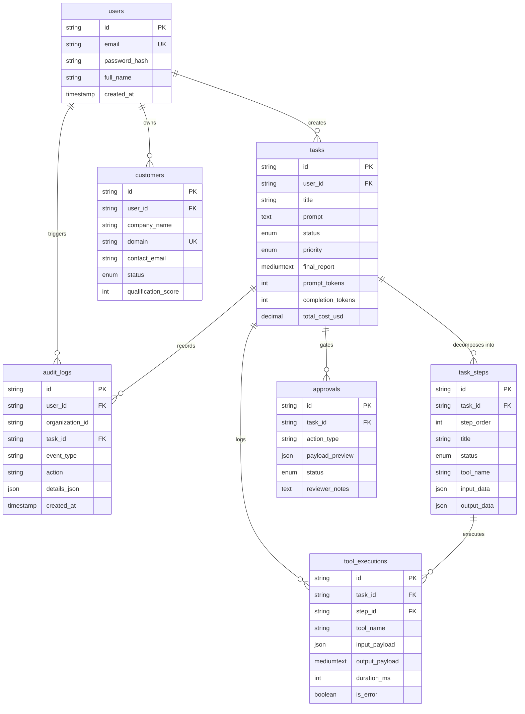

# Database Schema Specification

This document details the relational data model for the **AI Workforce Platform** implemented in MySQL 8.0+.

Reference DDL: [`docs/schema.sql`](file:///e:/ai-workforce-platform/docs/schema.sql)

---

## 1. Entity-Relationship Overview

---

## 2. Table Specifications

### 2.1 `users`
Represents platform accounts, authentication credentials, and multi-tenant scoping anchors.
- `id` (VARCHAR 64 PK): Internal stable user ID.
- `email` (VARCHAR 255 UNIQUE): Normalized lowercased email identity.
- `password_hash` (VARCHAR 255): bcrypt hashed password (never exposed to client).
- `full_name` (VARCHAR 100): Display name.
- `organization_id` (VARCHAR 64): Authoritative tenant ID.
- `role` (ENUM 'USER', 'ADMIN'): Access control role.

### 2.2 `tasks`
The central operational entity representing a durable unit of AI work.
- `id` (VARCHAR 36 PK): Stable unique task identifier.
- `user_id` (VARCHAR 64 FK): Creator identity derived from JWT.
- `organization_id` (VARCHAR 64): Authoritative tenant ID for strict query scoping.
- `title` (VARCHAR 255): Human-readable task title.
- `prompt` / `goal` (TEXT): Original user natural-language goal.
- `status` (ENUM 'REQUESTED', 'RUNNING', 'COMPLETED', 'FAILED', 'CANCELLED'): Authoritative host-controlled state machine.
- `priority` (ENUM 'LOW', 'NORMAL', 'HIGH', 'URGENT'): Execution priority.
- `final_report` (MEDIUMTEXT): Durable validated outcome/synthesis.
- `prompt_tokens`, `completion_tokens`, `total_cost_usd`: Telemetry metrics.
- `started_at`, `completed_at`, `created_at`, `updated_at`: Timestamps.

### 2.3 `task_steps`
Represents individual subtasks and execution milestones. Maintains deterministic execution sequence (`step_order`), tool references, inputs/outputs, and step status (`PENDING`, `IN_PROGRESS`, `COMPLETED`, `FAILED`, `SKIPPED`).
- In Phase 15, `input_data` stores DAG execution metadata: `{ "dependencies": string[], "allowedTools": string[], "description": string }` to power the deterministic step scheduler and UI dependency visualization.

### 2.4 `customers`
The operational CRM dataset. Scoped strictly to `organization_id` with composite uniqueness on `(user_id, domain)` to prevent cross-tenant leakage.

### 2.5 `tool_executions`
Granular telemetry log recording every single internal/external tool invocation. Linked to parent task (`task_id`) and parent step (`step_id`) with arguments, response payloads, duration, and error codes.

### 2.6 `approvals`
Stateful Human-in-the-Loop staging table. Holds proposed mutations (e.g., email drafts, database updates) until explicitly reviewed by the user.

### 2.7 `audit_logs`
Immutable compliance and security record tracking sensitive authentication and task lifecycle events (`USER_REGISTERED`, `USER_LOGIN_SUCCESS`, `TASK_CREATED`, `TASK_STARTED`, `TASK_COMPLETED`, `TASK_FAILED`, `TASK_CANCELLED`, `TASK_UPDATED`), action, actor `user_id`, and `organization_id`.

### 2.8 `ai_telemetry`
Records granular LLM token usage, duration, model identifiers, and dollar cost for every task execution run (`task_id`, `model`, `prompt_tokens`, `completion_tokens`, `total_tokens`, `latency_ms`, `estimated_cost_usd`, `created_at`).

